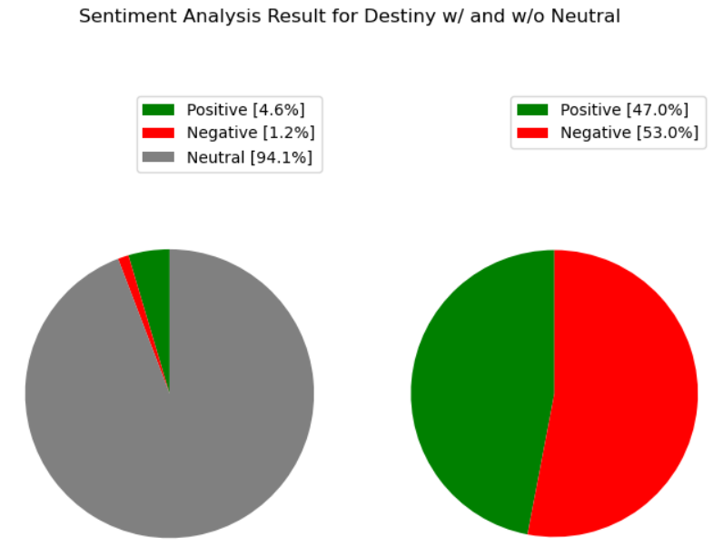
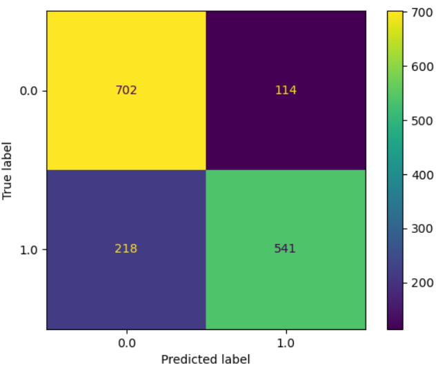

# Destiny 2 Twitter Community Sentiment Analysis

Author: **Andrew Bernklau**

## Technical Overview

In this project, I have created a sentiment analysis of the Destiny community on Twitter. This involved the develop of a Binary classification model that predicts the sentiment of tweets with #destinythegame based on a target variable formulated through a SentimentIntensityAnalyzer. This project can be used to predict the current sentiment of the Destiny community as well as providing inference on the community's likes and dislikes of the current state of the game. 

A list of the top words within positive and negative tweets were extracted and used to create columns that holds a count of the number of positive words and negative words within each tweet. After removing punctuation, uppercase letters, and urls sklearn's CountVectorizer was used to remove stopwords and vectorize. The majority class was used as the baseline which was 53% negative. The final model was a simple logistic regression with a thousand iterations. The final test score was 78%.

## Business Problem

Bungie has successfully created a story and gameplay that entices gamers. Bungie has the rest of the Destiny franchise planned out and now looks toward the Destiny community on Twitter. In order to gather a sense of the community's sentiment around Destiny 2, Bungie wants to analyze the twitter hype surrrounding Destiny 2. 

**The Goal**: Deliver a classification model to the stakeholder (Bungie) that can predict the sentiment of tweets involving Destiny 2. These predictions can bring light to the community's thoughts on Destiny 2. 

## Data Understanding

This dataset including 6.3k non-retweets within a seven day range from 11/16/2021 - 11/23/21. The Dawning event, which is a holiday event within Destiny was currently being held. 
This event made it easy to gather an understanding of the community's current wishes as a character returns during this event that is treated as a santa figure. Player's tweeted wishlists to this character that include information on their in game desires, whether it be a specific item or content rework/glitch fixes. 

## Data Preparation

The id of the user, text, language, time created, amount of favorites and amount of retweets were all included in the scrape of tweets. For this project only the text was used in the sentiment analysis. The text itself was ran through a SentimentIntensityAnalyzer to create a target variable and after it was cleaned of special characters, punctuation, stopwords and uppercase letters. Once this process was finished, the words were vectorized with a CountVectorizer.

## Feature Engineering

After running the text through a SentimentIntensityAnalyzer, the top occuring words in each category of negative and positive were accounted for in each tweet. This created two new columns, 'positive_word_count' and 'negative_word_count', that helped the models accuracy of classification of positive or negative

## Results

#### Sentiment Analyzer Scores
Using the three scores obtained by the SentimentIntensityAnalyzer - positive, negative, and neutral - the analyzer scored an overwhelmingly amount of neutral tweets. Reviewing the abundance of supposedly neutral tweets, these tweets had clear indication of positive and negative sentiment. This may have been due to semantic reasons. So the focus was steered to the positive and negative scores producing a nearly even split of positive and negative tweets.



#### Metric
Accuracy takes into consideration both false positives and false negatives. This metric proved useful as we want to know both negative sentiment and positive sentiment.

#### Model
This analysis used natural language processing so the prior processing had the greatest effect on the model's performance. Due to this A simple logistic regression model was used for classification. This model scored 79% accurate and a mean cross-val score of 78%. 



## Conclusion

The sentiment analysis proved there was a way to capture the concerns and wishes of the Destiny Community. It is advisable that this model be used to help quickly identify negative and positive tweets and from there identify concerns, bugs/glitches and even aspects of the game the Destiny community favorites.

## Future Research

* Scraping different platforms such as Destiny forums, Reddit, and even Twitch chats to gather the Destiny community's sentiment.
* Scraping Reddit for players who flaunt their extreme success in order to identify possible fraudulent gameplay.

## Links to Presentation and Technical Sources
See the full analysis in the [Jupyter Notebook](./destiny_sentiment_analysis.ipynb) or review the [presentation](./destiny_sentiment_analysis_pres.pdf).

## Repository Structure

```
├── code
│   ├── __init__.py
│   ├── auth_and_scrape.py
│   ├── environment.yml
│   ├── preparation.py
│   └── visualization.py
├── data
│   └── data.csv
├── images
│   ├── destiny_logo.png
│   ├── double_sentiment_analysis.png
│   ├── log_model_matrix.png
│   ├── sentiment_analysis_neu.png
│   └── sentiment_analysis.png
├── .gitignore
├── README.md
├── destiny_sentiment_analysis.ipynb
└── destiny_sentiment_analysis_pres.pdf
```
